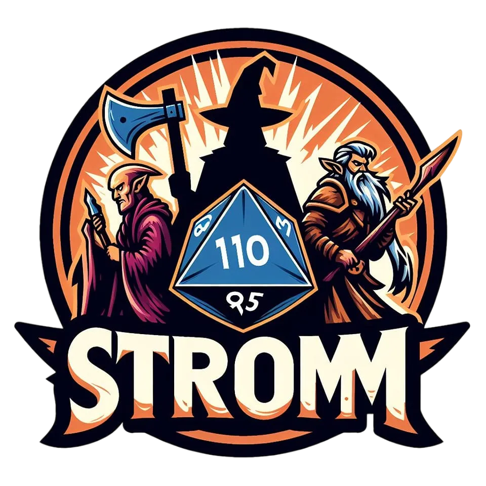
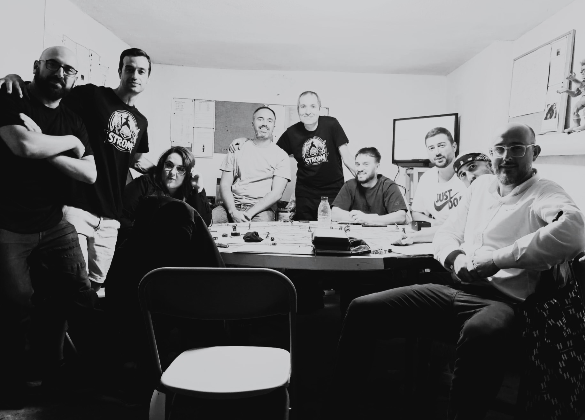

# StromRol - Generador de personajes para rol

# 
 

StromRol es una aplicación web desarrollada con React, TypeScript y Vite que permite generar personajes para juegos de rol de fantasía. Puedes seleccionar razas, clases y características para crear tu personaje de forma rápida y visual.

Strom es un juego de fantasia creado en 1996 por un grupo de chavales de Marbella. Esta inspirado y toma contenido de otros juegos de rol como: Stormbriger,Elric,Rune Quest y D&D. En la actualidad el juego se encuentra en al version 3.1.

## Características principales

- Selección de razas y clases personalizadas
- Visualización de habilidades y características
- Interfaz moderna y responsiva
- Generación aleatoria y edición manual de personajes

## Estructura del proyecto

- `src/` Código fuente principal de la aplicación
- `docs/` Carpeta donde se genera el build de producción para GitHub Pages
- `public/` Recursos públicos

## Despliegue en GitHub Pages

El proyecto está configurado para desplegarse automáticamente en GitHub Pages usando la carpeta `docs` del branch `main`. Se utiliza un archivo `.nojekyll` para evitar el procesamiento por Jekyll y servir correctamente los archivos generados por Vite.

### Pasos para desplegar

1. Ejecuta `npm run build` para generar el build en la carpeta `docs`.
2. Haz commit y push de los cambios al branch `main`.
3. Verifica que el archivo `.nojekyll` esté presente en `docs`.
4. Configura GitHub Pages para usar la carpeta `/docs` desde el branch `main`.

Accede a la aplicación en: [https://yeicogm.github.io/StromRol/](https://yeicogm.github.io/StromRol/)

---

Desarrollado por Yeicogm
