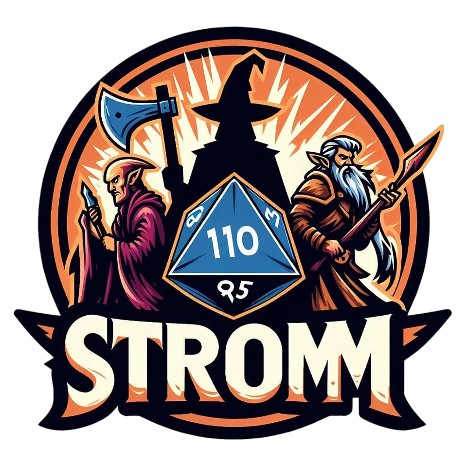

# StromRol - Generador de personajes para rol

StromRol es una aplicación web desarrollada con React, TypeScript y Vite diseñada para crear personajes para el juego de rol Strom (versiones 3.x y derivadas). La app incorpora selección de razas, clases, nacionalidades y orígenes, junto con cálculo dinámico de valores y tiradas de dados.

## 🧙‍♀️ Sobre Strom

Strom es un juego de fantasia creado en 1996 por un grupo de chavales de Marbella. Esta inspirado y toma contenido de otros juegos de rol como: Stormbriger,Elric,Rune Quest y D&D. En la actualidad el juego se encuentra en al version 3.1. Actualmente seguimos reuniendonos a jugar en el mismo sitio donde se creo.

## 🚀 Novedades y cambios implementados

- Interfaz de pestañas (tabs) por secciones:
  - `GENERADOR` (generación de fichas de personaje)
  - `LISTA DE EXITOS` (compendio de éxitos de juego)
  - `STROM` (información histórica / contextual)
  - `COMPENDIO` (documentación y detalles de reglas)
- Selección y cálculo automático:
  - Razas y clases cargadas desde JSON: `Razas.json`, `Clases.json`.
  - Nacionalidades y orígenes cargados desde JSON: `Nacionalidad.json`, `Origen.json`.
  - Filtros de origen según nacionalidad seleccionada.
  - Limitaciones de características específicas por clase.
- Generación aleatoria con botones de "🎲" para:
  - Raza aleatoria
  - Clase aleatoria
  - Nacionalidad por tabla (1-100)
  - Origen por tabla social (1-100)
- Cálculo de habilidades derivadas y bonificaciones:
  - Fuerza CC y AB, percepción, comunicación, agilidad, manipulación, discreción, salud mental y puntos de vida.
  - Ajuste automático de valores al validarlos frente a límites de clase.
- Modo responsivo:
  - Menú hamburguesa para mobile
  - Comportamiento adaptado a pantallas >450px

## 🧩 Estructura del proyecto

- `StromRol/src/` Código fuente React/TypeScript
- `StromRol/src/components/` Componentes UI reutilizables
- `StromRol/src/logic/` Lógica de cálculo de estadísticas y reglas de juego
- `StromRol/src/interfaces/` Tipos TypeScript para datos de razas, clases, nacionalidades, orígenes, habilidades
- `public/` Recursos estáticos, JSON de datos y assets
- `docs/` Build de producción para GitHub Pages

## 🛠️ Comandos principales

- `npm install` : instalar dependencias
- `npm run dev` : servidor de desarrollo
- `npm run build` : generar build de producción (output en `docs/` para deployment).
- `npm run lint` / `npm run format` : calidad de código (según configuración local)

## 📦 Despliegue en GitHub Pages

El proyecto está configurado para desplegarse desde `main` con la carpeta `docs`.

1. Ejecuta `npm run build`.
2. Confirma que `docs/.nojekyll` existe.
3. Commit + push de cambios.
4. En GitHub, configura Pages con branch `main` y carpeta `/docs`.

URL de acceso pública:

- https://yeicogm.github.io/StromRol/

Desarrollado por Yeicogm
